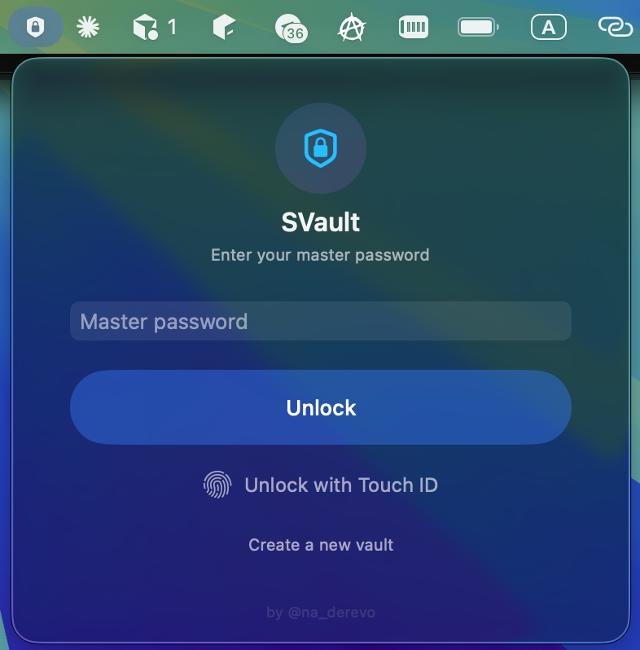
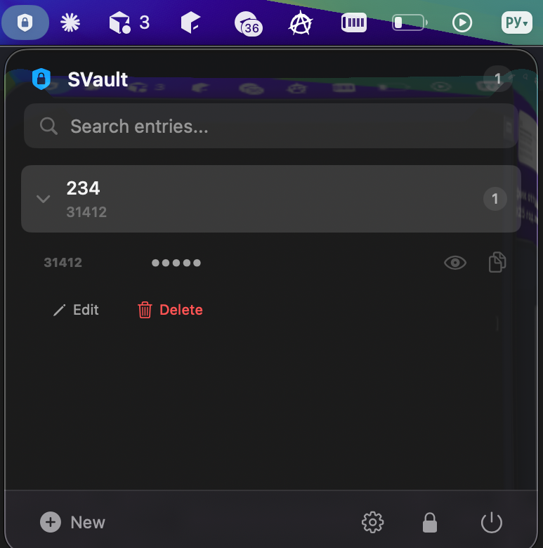

  
  

# SVault — Local Encrypted Secret Storage for macOS

**English** | [Русский](#svault--локальное-зашифрованное-хранилище-секретов-для-macos)

A lightweight macOS menu bar app for securely storing passwords, API keys, seed phrases, and other secrets — fully encrypted at rest, never touching the network.

## Features

- **Menu bar only** — no Dock icon, always one click away
- **AES-256-GCM encryption** — all data encrypted at rest via CryptoKit
- **Touch ID / fingerprint unlock** — quick access without typing your master password
- **Multi-field entries** — each secret can have multiple key/value fields (e.g. Username, Password, URL)
- **Full-text search** — instant search across all entries and fields
- **Auto-lock** — vault locks automatically on inactivity, screen lock, or system sleep
- **Clipboard auto-clear** — copied secrets are cleared from clipboard after 30 seconds
- **Automatic backups** — last 5 copies of your vault are kept in case of corruption
- **Password strength meter** — visual feedback when creating your master password
- **No network, no telemetry** — 100% local, nothing leaves your machine

## Screenshots

  
  

## Installation

### Download DMG

1. Go to [Releases](https://github.com/dronikosha/SVault/releases)
2. Download the latest `SVault-1.0.dmg`
3. Open the DMG and drag **SVault** to the **Applications** folder
4. Right-click the app and select **Open** (required on first launch for unsigned apps)

### Requirements

- macOS 14 (Sonoma) or later
- Apple Silicon or Intel Mac

## Usage

1. **Launch SVault** — it appears in your menu bar as a lock icon
2. **Create a vault** — set a strong master password on first launch
3. **Add entries** — click **+ New** or press `⌘N` to add a new secret
4. **Search** — start typing to filter entries instantly
5. **Copy a field** — click the copy icon next to any field value
6. **Lock** — press `⌘W` or click the lock icon to lock the vault

### Keyboard Shortcuts

| Shortcut | Action |
|----------|--------|
| `⌘N` | New entry |
| `⌘W` | Lock vault |
| `⌘,` | Settings |
| `⌘F` | Focus search |
| `⌘Q` | Quit SVault |
| `Esc` | Go back / close panel |

## Security

- **Encryption**: AES-256-GCM with envelope encryption (DEK + KEK)
- **Key derivation**: HKDF-SHA256 from master password
- **Keychain**: DEK stored in macOS Keychain with `kSecAttrAccessibleWhenUnlockedThisDeviceOnly`
- **No plaintext on disk** — vault file contains only encrypted data
- **Memory**: DEK is cleared from memory on lock and application quit

## Author

Created by [@na_derevo](https://t.me/na_derevo)

## License

Proprietary. All rights reserved. Source code is not distributed.

---

# SVault — Локальное зашифрованное хранилище секретов для macOS

**English** | [Русский](#svault--локальное-зашифрованное-хранилище-секретов-для-macos)

Лёгкое приложение для строки меню macOS для безопасного хранения паролей, API-ключей, seed-фраз и других секретов. Все данные зашифрованы на диске, приложение не использует сеть.

## Возможности

- **Только строка меню** — без иконки в Dock, всегда в одном клике
- **Шифрование AES-256-GCM** — все данные зашифрованы с помощью CryptoKit
- **Разблокировка по Touch ID / отпечатку** — быстрый доступ без ввода мастер-пароля
- **Несколько полей в записи** — каждый секрет может содержать несколько полей ключ/значение (например, Логин, Пароль, URL)
- **Полнотекстовый поиск** — мгновенный поиск по всем записям и полям
- **Автоблокировка** — хранилище блокируется при бездействии, блокировке экрана или сне системы
- **Автоочистка буфера обмена** — скопированные секреты удаляются из буфера через 30 секунд
- **Автоматические резервные копии** — хранятся последние 5 копий хранилища
- **Индикатор надёжности пароля** — визуальная оценка мастер-пароля при создании
- **Без сети и телеметрии** — 100% локально, ничего не покидает ваш компьютер

## Скриншоты

  
  

## Установка

### Скачивание DMG

1. Перейдите в [Releases](https://github.com/dronikosha/SVault/releases)
2. Скачайте последнюю версию `SVault-1.0.dmg`
3. Откройте DMG и перетащите **SVault** в папку **Программы**
4. Нажмите правой кнопкой на приложении и выберите **Открыть** (требуется при первом запуске для неподписанных приложений)

### Требования

- macOS 14 (Sonoma) или новее
- Apple Silicon или Intel Mac

## Использование

1. **Запустите SVault** — иконка замка появится в строке меню
2. **Создайте хранилище** — задайте надёжный мастер-пароль при первом запуске
3. **Добавляйте записи** — нажмите **+ New** или `⌘N` для добавления нового секрета
4. **Ищите** — начните вводить текст для мгновенного поиска
5. **Копируйте поля** — нажмите иконку копирования рядом со значением поля
6. **Блокируйте** — нажмите `⌘W` или иконку замка для блокировки

### Горячие клавиши

| Клавиша | Действие |
|---------|----------|
| `⌘N` | Новая запись |
| `⌘W` | Заблокировать хранилище |
| `⌘,` | Настройки |
| `⌘F` | Фокус на поиск |
| `⌘Q` | Выйти из SVault |
| `Esc` | Назад / закрыть панель |

## Безопасность

- **Шифрование**: AES-256-GCM с конвертным шифрованием (DEK + KEK)
- **Ключ**: HKDF-SHA256 из мастер-пароля
- **Keychain**: DEK хранится в связке ключей macOS с `kSecAttrAccessibleWhenUnlockedThisDeviceOnly`
- **На диске только зашифрованные данные** — файл хранилища не содержит открытого текста
- **Память**: DEK удаляется из памяти при блокировке и выходе из приложения

## Автор

Создано [@na_derevo](https://t.me/na_derevo)

## Лицензия

Проприетарная. Все права защищены. Исходный код не распространяется.
